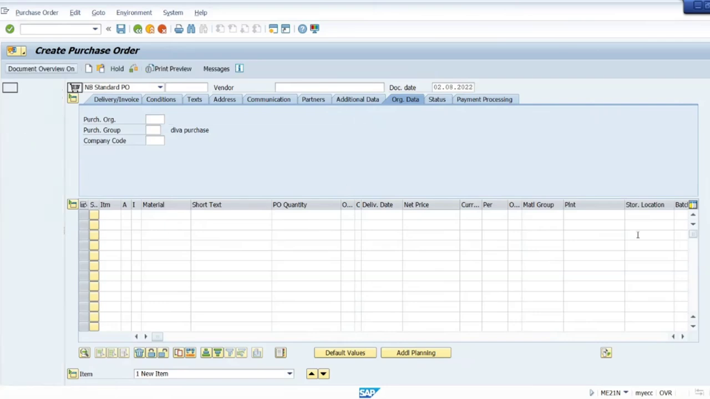
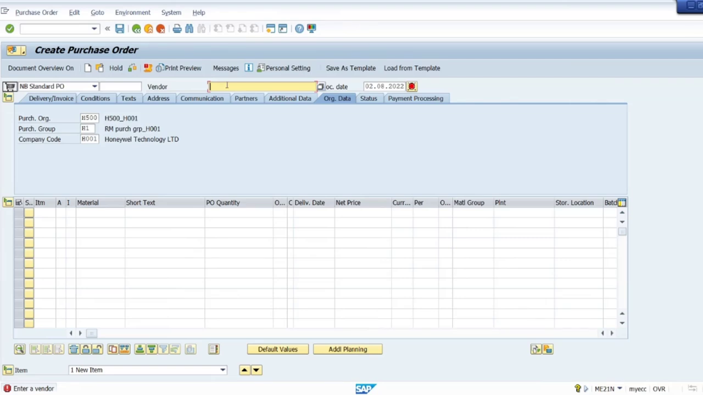

# SAP Documentation

## Creating a Purchase Order

## Purpose

To create and manage a purchase order for specific materials or services.

## Procedure

### Step 1
**Initial Screen**
The initial screen displays the creation of a standard purchase order with various options like document overview, hold, print preview, messages, personal settings, save as template, and load from template.

### Step 2
**Enter Vendor Details**
Input the vendor's number in the respective field. The system will pre-fill other details like purchasing organization, purchasing group, and company code if they are configured to do so.

### Step 3
**Input Document Date**
Enter the document date. The system will automatically fill in some fields like conditions, texts, address, and communication partners based on your configuration.

### Step 4
**Purchasing Organization**
Enter the purchasing organization details. These may be filled automatically depending on your system configuration.

### Step 5
**Purchasing Group and Company Code**
Input or confirm the purchasing group and company code. If these are configured to be auto-filled, they may appear here.

### Step 6
**Document Overview**
Review the document overview with the vendor details, purchasing organization, and company code. Ensure all fields are correctly filled in.

### Step 7
**Enter Material Details**
Add materials or services you want to purchase by entering the material number in the designated field. The system will automatically fill other related fields.

### Step 8
**Material Field**
Enter the specific material number in the material field to add it to the purchase order.

### Step 9

### Step 10

### Step 11

### Step 12

### Step 13

### Step 14

### Step 15

### Step 16

### Step 17

### Step 18

